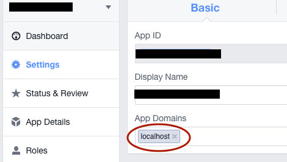

# Facebook Requirements and Set-Up [Web App]

To use this plugin you will need to make sure you've registered your Facebook app with Facebook and have an `APP_ID` [https://developers.facebook.com/apps](https://developers.facebook.com/apps).

This guide is for browser only. View the other guides for native setup.

`www/facebookConnectPlugin.js` contains the JavaScript SDK and API file. The API matches as close as possible to the native APIs.

## Example App

For localhost testing on OS X see the [Localhost guide](LOCALHOST_GUIDE.md)

## Install

This plugin requires [Cordova CLI](https://cordova.apache.org/docs/en/5.0.0/guide_cli_index.md.html).

To install the plugin in your app, execute the following (replace variables where necessary):

```sh
# Create initial Cordova app
$ cordova create myApp
$ cd myApp/
$ cordova platform add browser

# Remember to replace APP_ID and APP_NAME variables
$ cordova plugin add cordova-plugin-facebook4 --save --variable APP_ID="123456789" --variable APP_NAME="myApplication"
```

## Setup

- The difference between the JS API and Native is that the Facebook JS SDK must be initiated. Here is an example:

```js
if (window.cordova.platformId == "browser") {
  facebookConnectPlugin.browserInit(appId, version, success);
  // version is optional. It refers to the version of API you may want to use.
  // success is optional. It calls the function when the SDK has been inited
}
```

- In your facebook develop website settings page, add your server's domain to app domain (or localhost for testing).


